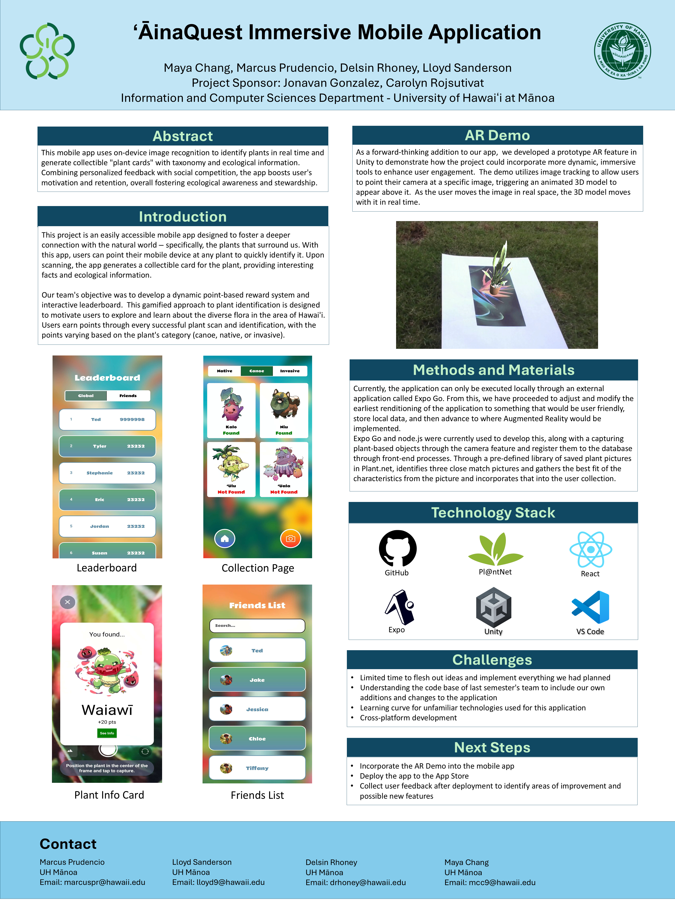

  

## Overview
In collaboration with ‘ĀinaQuest, I and three other teammates designed and developed a __

An additional AR component was developed and tested in Unity by me and a teammate that identified photos of plants and generated a corresponding 3D model that the user could move around the screen.  Because of time constraints, only a demo was completed and it was not integrated into the final product.

#### [Click for the Video Demo](https://drive.google.com/file/d/1foIuSZwdpoqSD7WvEww9xceMGcawQ7OV/view?usp=sharing)