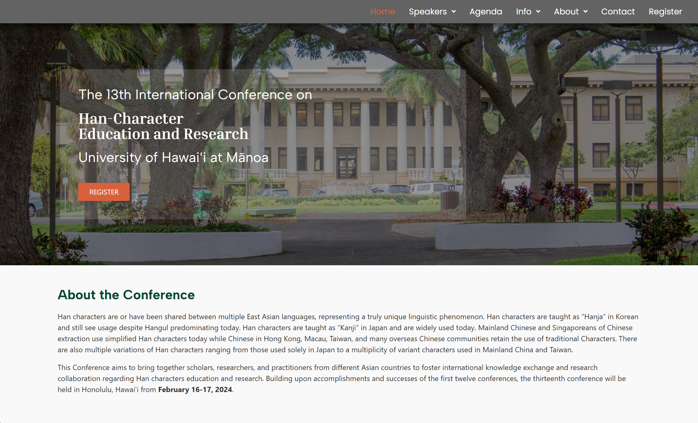

  

## Overview

The IHER13 website was entirely designed, developed, and deployed by me during my time working for the Center for Chinese Language Education (CCLE) as a student tech assistant.  It serves as a central hub for details on the 13th International Conference on Han-Character Education and Research (IHER13) hosted by the CCLE at the University of Hawaiʻi at Mānoa on February 16-17, 2024.  It includes basic information on the speakers and conference agenda as well as various helpful tips on finding lodging, directions to the conference site, and sightseeing highlights for attendees.  It now serves as a digital record of the event.

#### [View Deployed Site](https://manoa.hawaii.edu/ccle/iher13/)
(the website may take a few seconds to load, please be patient)

