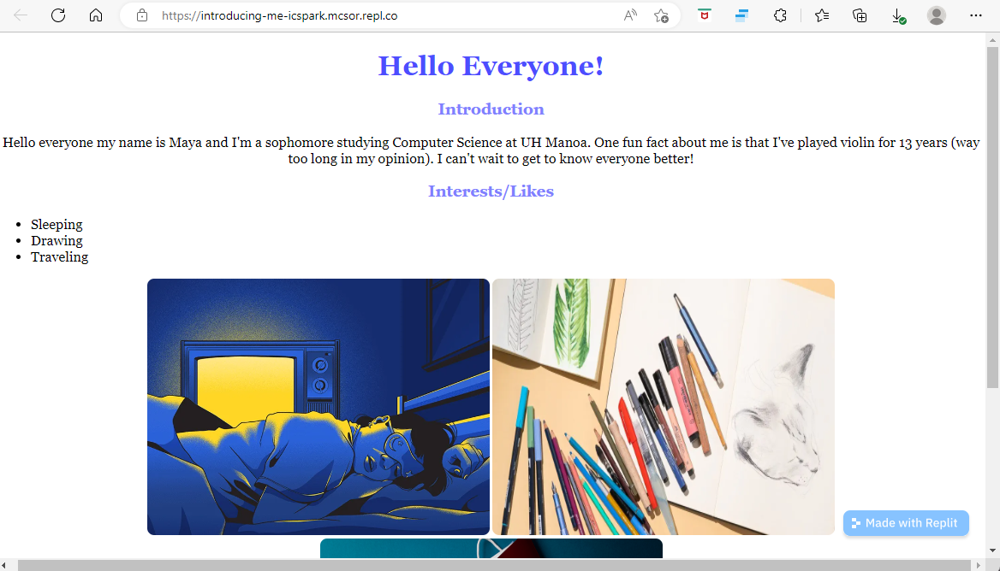

Introducing Me is a very simple project I made for UH’s ICSpark curriculum that is meant to help students practice the HTML and CSS skills they will learn in the first week of the program.  Due to the fact my project is used at a time when the students are just getting used to the basics of coding in HTML and CSS, I attempted to make my project as simple as possible so the students could practice using simple HTML tags and CSS properties without too much trouble.  The goal of the project is to create a website introducing the author.  

To make it as easy as possible for the students to follow along, I wrote detailed instructions for the format of the website and included example code.  However, I also made sure I gave the students enough leeway so they could add their own personal flair to their website.  For example, for Step 3 I require them to add a paragraph describing themselves to their website using the 
<\p> tags.  This will allow them to practice using the paragraph tag while also giving them space to be creative.

Making this project was my first time using github, therefore I struggled a little at the beginning to get started.  However, after researching a little on the internet into how to use it I was able to figure out how to create and edit my ReadMe.md file as well as add in my source code for the example website.

You can view my github repository using the following [link](https://github.com/mcsor/Introducing-Me).
