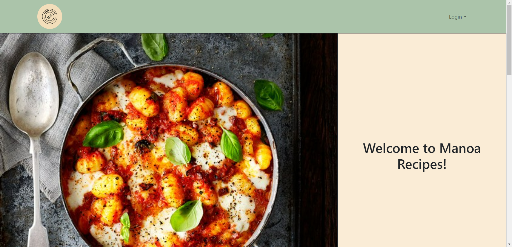
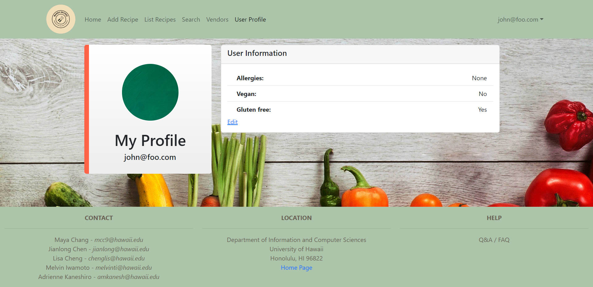
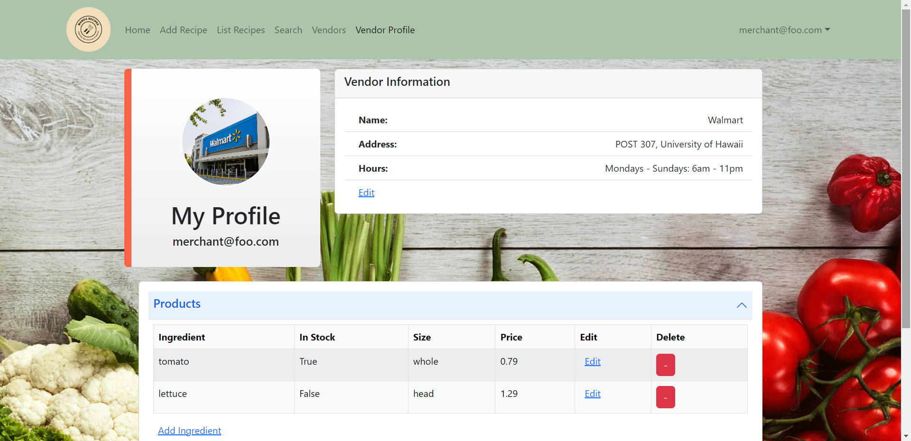

# Overview

    

Manoa Recipes is an application I made as part of a group project for my ICS 314 class that aims to provide college students easy access to low budget, simple recipes they can make at home.  Users are able to look through recipes uploaded to the site as well as add their own.  By using the search page, users can look for recipes based off of specific ingredients.  Additionally, the "List Recipe" page has a filter feature that allows the user to filter out vegan and gluten-free recipes.

    
    

Depending on the role the user chooses, a different profile is available.  If they are a regular user, their profile displays their allergies, and whether they are vegan and/or gluten-free.  If they are a vendor, their profile displays their name, location, and hours as well as the ingredients they sell.

# My Contributions
For this project, I was mainly in charge of creating the landing page and vendor profile.  For the landing page, I created a simple design that provides users with a simple rundown of what our application offers.  The vendor profile was made to pull the signed in vendor's information from the mongo database and display it for the vendor to see.  I also added the capability of easily changing and updating this information through the various edit links displayed on the page as well as the red buttons (which is only used for deleting ingredients).  

Although my main focus was getting the functionality of the landing page and vendor profile working, if my group members needed assistance, I would switch my focus to whatever they were working on to help.  Along with one of my other group members, I also worked on updating my group's project home page with the application's currently implemented functionalities after each milestone was completed.

*You can find links to the project home page as well as the deployed website below.*

# Takeaways
This project was the first time I have ever worked on a group coding project.  Because I'm used to working on coding projects myself, it took me a little while to get used to coding as a group.  However, it also provided me with the opportunity to learn more about group management and how to work efficiently through virtual means.  For example, learning how to use github issues made it easier for my group members and I to communicate as it allowed us to easily dictate and see which group member would implement which functionality. Working on Manoa Recipes also taught me a lot about saving and pulling information from databases as well as how to design applications in a way that makes them easy for consumers to utilize.

### [Site Home Page](https://manoa-recipes.github.io/)

